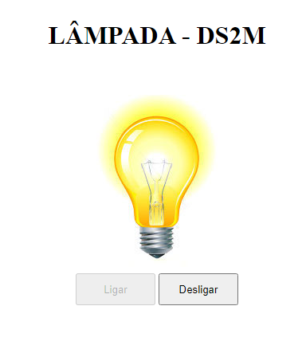
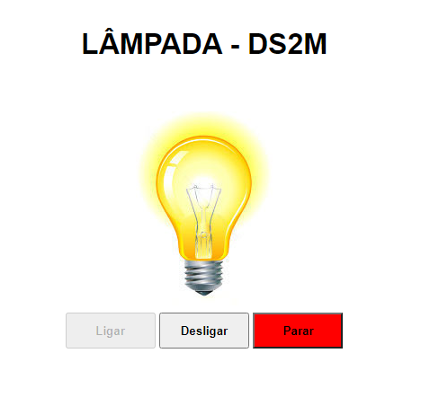

# LÂMPADA - DS2M
Projeto criado com o objetivo didático para as aulas de PWFE do curso de Desenvolvimento de Sistemas do [SENAI Jandira](https://jandira.sp.senai.br/), sobre orientação do professor [Fernando Leonid](https://github.com/fernandoleonid).

O projeto consiste em criar uma lâmpada que tenha três ações:
* ligar 
* desligar
* quebrar

Todo o código foi construído seguindo as boas práticas como responsabilidade única e funções puras.

